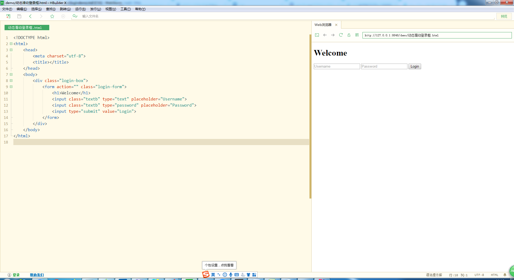
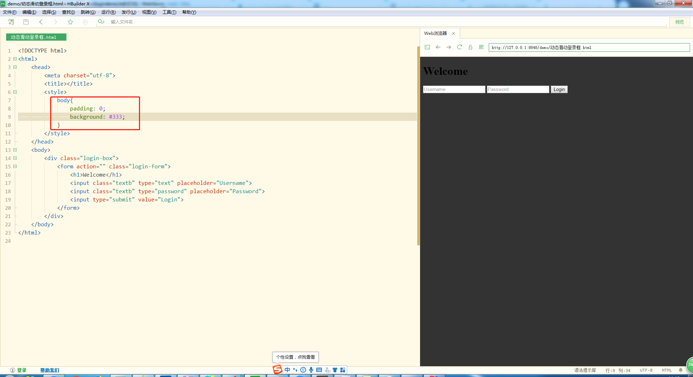
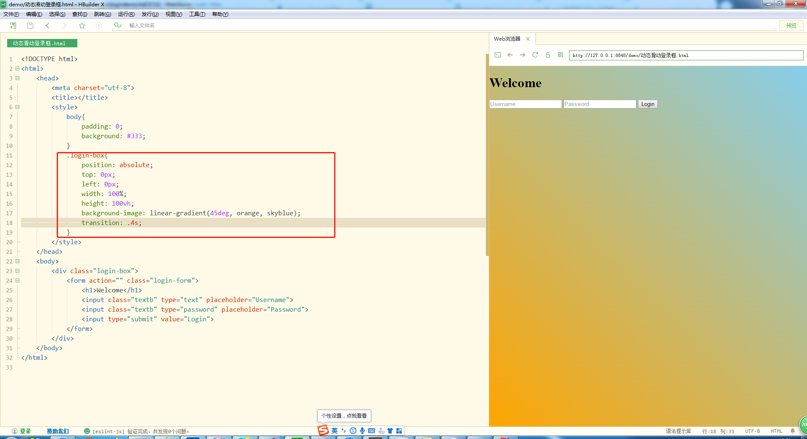
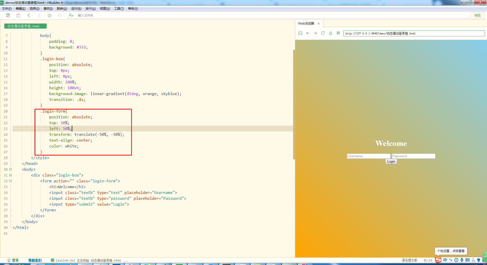
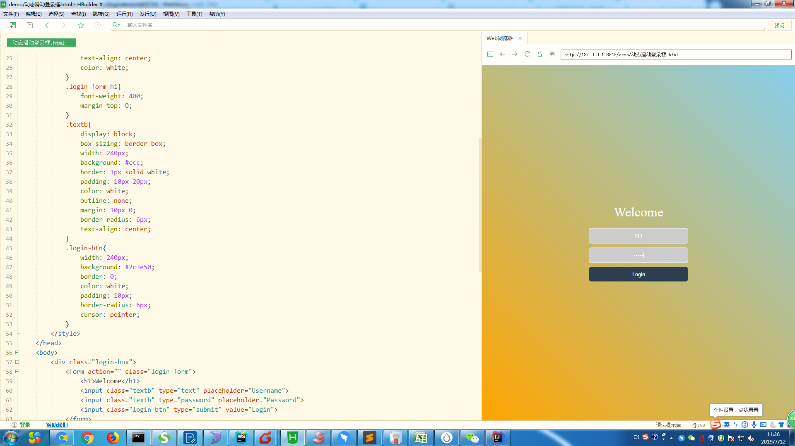
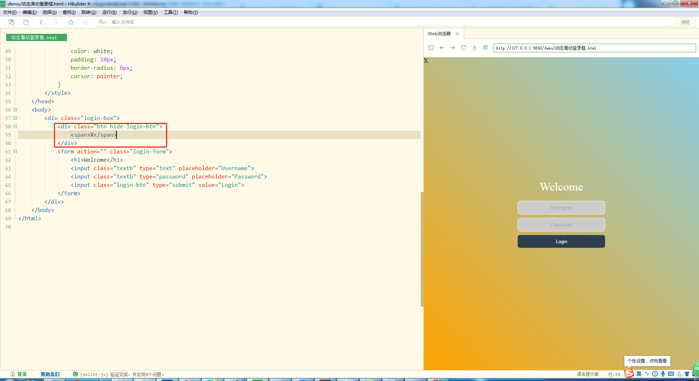
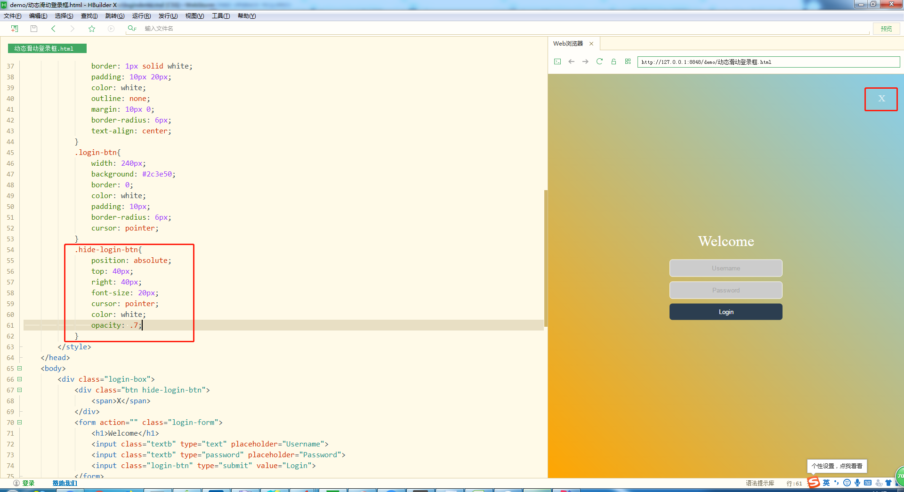
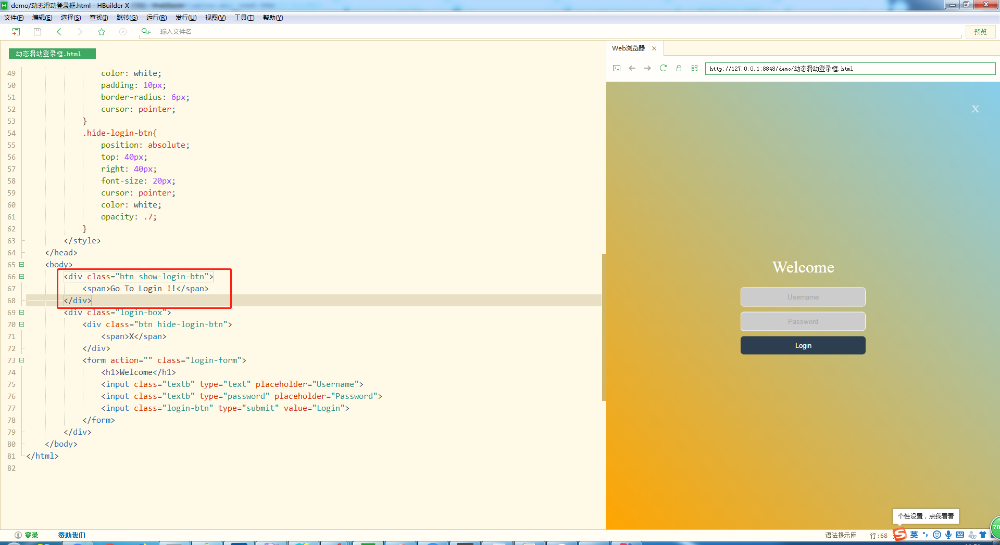
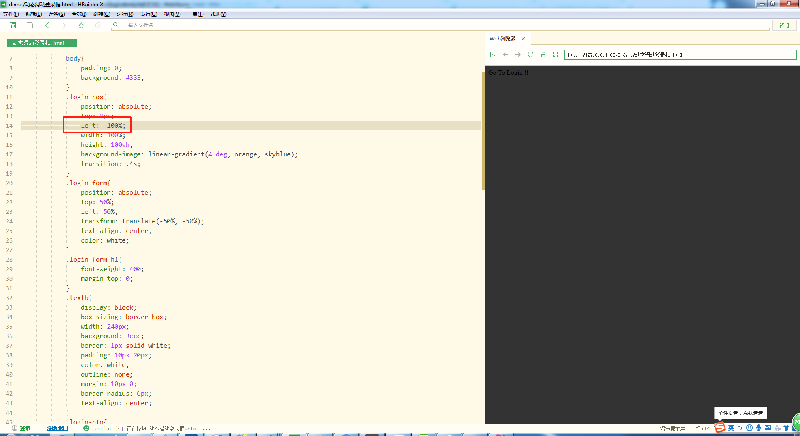
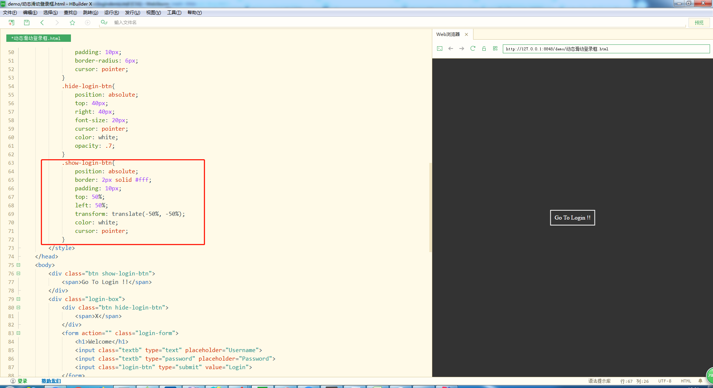

# logindemo的制作过程
1. 先把登陆界面的表单骨架搭好，具体代码如下
    ```
    <!DOCTYPE html>
    <html>
        <head>
            <meta charset="utf-8">
            <title></title>
        </head>
        <body>
            <div class="login-box">
                <form action="" class="login-form">
                    <h1>Welcome</h1>
                    <input class="textb" type="text" placeholder="Username">
                    <input class="textb" type="password" placeholder="Password">
                    <input type="submit" value="Login">
                </form>
            </div>
        </body>
    </html>
    ``` 
2. 在没有加入CSS前(即没化妆前)，我们的样子是这样的
    
      

3. 因为是小demo，我们这边就直接在style内添加样式，先给登陆界面加样式
    1. 先给body加个背景颜色，清除默认样式padding设为0
    
        
    
    2. 我们给login-box进行化妆,这里要注意高度用的是vh单位
    
        
        
    3. 在给login-form化妆，这里先让他居中，然后调整样式
    
          
        
    4. login-form里的标题，input表单元素样式调整，前面忘记给button按钮加class类名了这里加上"login-btn"      
    
        
  
4. 右上角要加一个X的按扭  
    1. 页面结构先加上这个X
        
        
        
    2. 我们会发现在"化妆术"之前，这个X就在页面的左上角，然后我们对他进行定位，样式的修改
    
         
 
5. 到这步位置，我们已经把登陆样式完全做好了，现在就要做动态滑动了
    1. 老样子，先来做结构
        
        
        
    2. 为什么我们这边看不到我们写的show-login-btn呢，因为之前的定位把我们这个遮住了
        所以我们只要把login-box往左移动100%的就能看到他们了  
        
          
        
    3. 来给show-login-btn化妆
    
            
        
6. 动画效果其实就是改变login-box的left值
    1. 增加个.show的样式
        ```
        .show{
            left: 0;
        }
        ```
    2. 编写简单的js代码
        ```
        (function(){
            let aBtn = document.querySelectorAll(".btn"); //获取按钮
            let oBox = document.querySelector(".login-box");
            [...aBtn].forEach((item) => {
                item.onclick = () => {
                    oBox.classList.toggle("show");
                };
            });
        })();
        ```     
7. 这样就大功告成了，点击运行看效果吧，[在线demo](https://qianfengg.github.io/CSS/logindemo/index)              
            
        
                           