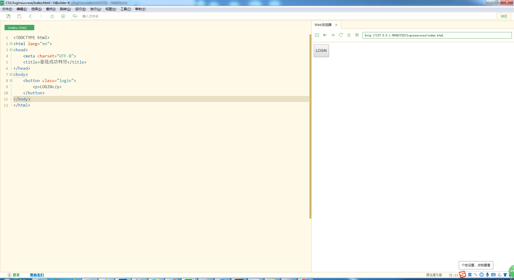
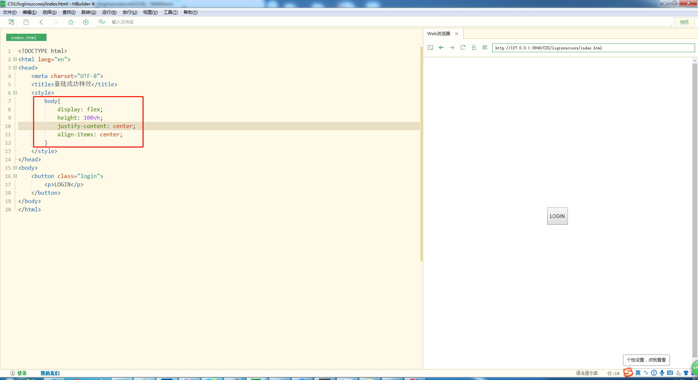
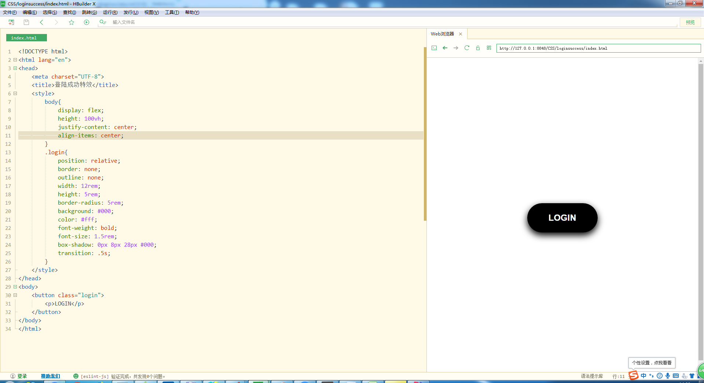
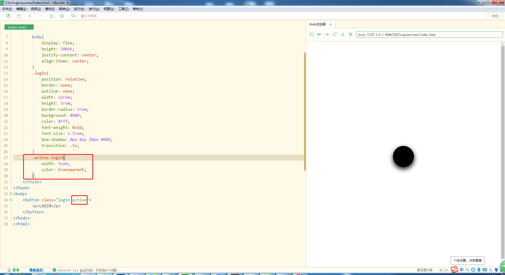

# loginsuccess的制作过程
1. 先搭架子
    1. 写一个button元素，里面一个p元素
        ```
        <!DOCTYPE html>
        <html lang="en">
        <head>
            <meta charset="UTF-8">
            <title>登陆成功特效</title>
        </head>
        <body>
            <button class="login">
                <p>LOGIN</p>
            </button>
        </body>
        </html>
        ```
    2. 这个时候页面应该就是这个样子的
        
          
        
2. 开始化妆
    1. 先给body添加flex属性，通过弹性盒子，让按钮居中  
        
           
        
    2. 给Button化妆(这里忘记加cursor的属性了后来又补上了)  
        
            
        
    3. 增加个Button的active的样式，然后我们在html中的class加上active测试
    
        
        
    4. 测试好我们可以把active类名删除，写个简单的js来玩下
        
        ```
        let oButton = document.getElementsByClassName("login")[0];
        oButton.onclick = function(){
            this.classList.toggle("active");
        }
        ``` 
        
    5. 运行后就完成了简单的一个交互，棒棒哒，我们后面先做...的动画
    6. 如何做...的动画                
            