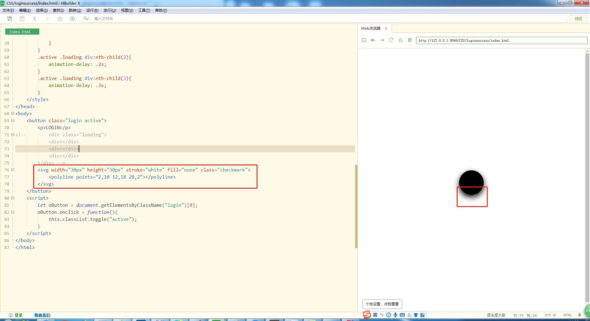

# loginsuccess的制作过程
1. 先搭架子
    1. 写一个button元素，里面一个p元素
        ```
        <!DOCTYPE html>
        <html lang="en">
        <head>
            <meta charset="UTF-8">
            <title>登陆成功特效</title>
        </head>
        <body>
            <button class="login">
                <p>LOGIN</p>
            </button>
        </body>
        </html>
        ```
    2. 这个时候页面应该就是这个样子的
        
          
        
2. 开始化妆
    1. 先给body添加flex属性，通过弹性盒子，让按钮居中  
        
           
        
    2. 给Button化妆(这里忘记加cursor的属性了后来又补上了)  
        
            
        
    3. 增加个Button的active的样式，然后我们在html中的class加上active测试
    
        
        
    4. 测试好我们可以把active类名删除，写个简单的js来玩下
        
        ```
        let oButton = document.getElementsByClassName("login")[0];
        oButton.onclick = function(){
            this.classList.toggle("active");
        }
        ``` 
        
    5. 运行后就完成了简单的一个交互，棒棒哒，我们后面先做...的动画
    6. 如何做...的动画
        1. 先做结构，3个点就是3个div 
        
            
        
        2. 这里为了方便调试，我们先把前面button的active加上
        3. 先做第一步，因为loading的时候才出来效果，所以一开始是opacity为0，active的时候才为1
            ```
                .loading{
                    opacity: 0;
                    transition: .5s;
                }
                .active .loading{
                    opacity: 1;
                }
            ``` 
        4. 然后我们把loading先放在黑色圆圈的最中间，调试的时候先给loading加个背景颜色 
            ```
            .active .loading{
                position: absolute;
                top: 50%;
                left: 50%;
                transform: translate(-50%, -50%);
                width: 70%;
                height: 40%;
                background: #fff;
                opacity: 1;
            }
            ```  
            
            
        
        5. 然后看到在中间以后，我们就可以把loading的背景颜色去除了(前面只是为了调试)，然后做3个点的样式，
            这边依然还是要给loading加上flex属性，通过弹性盒子布局三个点
            
            
            
        6. 接下去就可以做动画了，为了有好看的动画效果，第二个点和第三个点还要设置延迟属性  
        
              
                                        
    6. 如何做√的动画
        1. 这里使用svg做勾的动画，为了方便调试我们把html里的loading这一块结构先注释掉，然后添加svg  
        
             
            
        2. 给svg化妆，让勾的位置合理点
        
            
            
        3. 开始做动画，svg的动画主要是用stroke-dasharray和stroke-dashoffset   
        
             
            
        4. 这里已经有勾的渲染动画效果了，然后这个时候我们要考虑下，
            其实这个勾的动画是不是在3个点跳跃一段时间后才会出来，所以我们这个动画效果要额外加个样式，
            然后用js去控制他延迟调用，原先添加动画的这行代码删除，然后把button上active的类名也删除下 
            
               
            
        5. 然后运行看效果，基本没撒问题，然后有一个小小的交互问题
    7.优化这个交互问题
        * 在勾出来的时候三个点并没有隐藏
        * 所以我们要在样式上给三个点添加隐藏，其实就是在勾出来的时候隐藏3个点
            ```
            .verity .loading{
                opacity: 0;
            }
            ```        
    8. 大功告成最终的效果就是这样的[在线预览](https://qianfengg.github.io/CSS/loginsuccess/index)    
                    